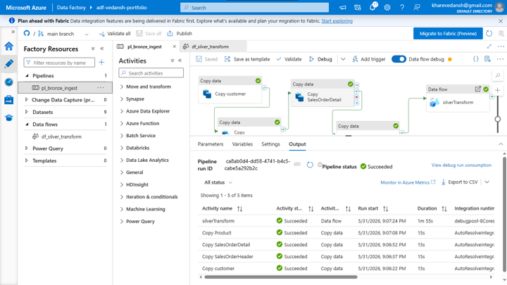
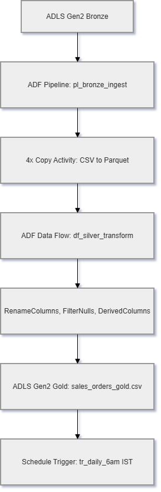

# fabric-sales-lakehouse

# 🏭 Sales Analytics Lakehouse | ADF + Azure Portfolio

> Enterprise ETL migrated from Informatica PowerCenter to Azure Data Factory + ADLS Gen2 Medallion Architecture

## 🏗️ Architecture

CSV Source (AdventureWorks) → [Bronze Layer] Raw Files in ADLS Gen2 → [Silver Layer] Cleaned, typed data → [Gold Layer] Aggregated analytics

## 🛠️ Tech Stack
- Azure Data Factory (V2)
- Azure Data Lake Storage Gen2
- Delta Lake / Parquet
- Python / PySpark
- GitHub Actions CI/CD

## 📊 Dataset
AdventureWorks Sales — Microsoft sample database

## 🔄 Informatica → ADF Migration Map
| Informatica | ADF Equivalent |
|---|---|
| Mapping | Data Flow |
| Session | Pipeline Activity |
| Workflow | Pipeline |
| Source/Target | Linked Service + Dataset |

## Pipeline Run — All Green ✅

## Architecture

## 👤 Author
Vedansh Khare | Informatica ETL → Azure Data Engineer
